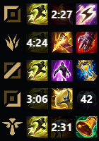

# League of Legends Summoner Spell Overlay

A lightweight **League of Legends overlay** built using Windows Presentation Foundation (WPF) to display and countdown enemy summoner spell cooldowns.  

> This project was created as a **personal WPF practice project** to learn and experiment with building desktop applications.


<p align="center">
  
</p>

---

## ⚠️ Disclaimer

This overlay does **not inject or modify the game**.
**The developer is not responsible** for any issues, penalties, or account suspensions that may occur while using this software.  
### **_Use at your own discretion._**

---

## 🚀 Installation
1. Download the latest release ZIP from the [**Releases**](https://github.com/Viktor-9904/LolSpellOverlay/releases/latest) page.
2. Extract the ZIP to any folder on your computer.
3. Inside the extracted folder, locate: **``` LolSpellOverlay.exe ```**
4. Double-click **``` LolSpellOverlay.exe ```** to start the application.
  > **Note:** On first launch, Windows may show a SmartScreen popup warning because the app is unsigned.
  >
  > Click **“More info”** → **“Run anyway”** to proceed.
---

## 🎮 Controls

- **Left Click/Scroll Down:**  
  - If spell is not on cooldown → set cooldown  
  - If spell is on cooldown → reduce remaining spell cooldown by 1 second  

- **Right Click:**  
  - If spell is on cooldown → reset remaining cooldown
 
- **Scroll Up:**  
  - If spell is on cooldown → increase remaining spell cooldown by 1 second  

- **Ctrl + Left Click:**  
  - Cycles to the **next spell**  

- **Ctrl + Right Click:**  
  - Cycles to the **previous spell**
  - Pressing Ctrl + Right Click on a laner icon lets the user indicate if they have Cosmic Insight or Ionian Boots of Lucidity, so the app can calculate summoner spell haste accurately.
---


## 💡 Notes

- Works best when **League of Legends is in borderless/windowed mode**.
- The overlay **will not appear in exclusive fullscreen mode** due to Windows limitations.
- The application runs completely **offline** and does not require an internet connection.
- The app plays a sound effect when a spell’s remaining cooldown reaches 20 seconds. You can adjust the volume or mute the app via the Windows mixer if desired.

---

## 💻 Requirements

- Windows 10 or 11  
---

## 📜 License

This project is licensed under the **MIT License**


